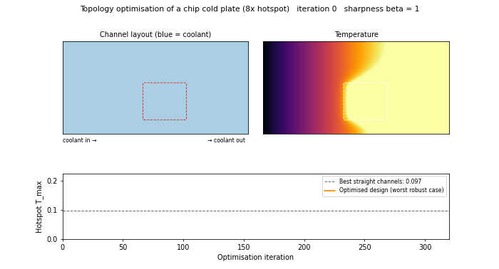

# Cold-Plate Topology Optimisation: Adjoint Sensitivities + MMA

The geometry inside a liquid cold plate decides how well it cools a chip. Its microchannels have to
route coolant to the hotspots without wasting pumping power on cool regions. This project
**computes that geometry** with density-based topology optimisation. A coupled flow and heat-transfer
model is differentiated with a hand-derived **discrete adjoint**, and the layout is optimised with the
**Method of Moving Asymptotes**. A robust (eroded/blueprint/dilated) formulation enforces a minimum
feature size, so the final design is crisp and manufacturable.



*`figures/optimisation_movie.mp4`: the channel network forming during optimisation for a chip with an
8× hotspot (dashed box). Left: design (blue = coolant). Right: temperature. Bottom: hotspot temperature
vs. the best straight-channel design.*

## Model

A plan-view (2.5-D) cold plate on a 120 × 60 finite-volume grid. Coolant enters along the left edge and
leaves on the right, driven by a fixed pressure drop. The chip injects heat into every cell, and a
hotspot region injects 4× or 8× more.

| Physics | Equation | Discretisation |
|---|---|---|
| Flow (Darcy) | ∇·(κ(ρ)∇p) = 0 | two-point flux, harmonic face averages |
| Heat (advection–diffusion) | ∇·(k(ρ)∇T) − C u·∇T + Q = 0 | first-order upwind (exactly conservative) |

Each cell has a density ρ ∈ [0, 1], where 1 is coolant and 0 is metal. RAMP interpolation makes metal
conduct about 100× better than coolant while being impermeable. Coolant carries heat away by advection
but conducts poorly, and the optimiser has to balance the two. The objective is a p-norm (p = 8) of
temperature, a smooth stand-in for the hotspot temperature. A volume constraint limits the coolant
fraction.

## Method

1. **Discrete adjoint of the coupled system.** Two extra linear solves give the gradient with respect to
   all 7,200 design variables: Aᵀ_T λ_T = ∂J/∂T, then Aᵀ_p λ_p = −(∂R_T/∂p)ᵀ λ_T. The pressure adjoint
   accounts for how the flow field changes the upwind advection terms. **Checked against central finite
   differences: maximum relative error 1.9 × 10⁻⁹** (`fig3_adjoint_check.png`).
2. **MMA** (Svanberg), implemented from scratch: separable convex subproblems on moving asymptotes,
   solved through their one-dimensional dual.
3. **Density filter + Heaviside projection** with β-continuation (1 → 32), giving a minimum length scale
   and crisp 0/1 designs.
4. **Robust formulation** (Wang, Lazarov & Sigmund 2011). A smooth maximum of the eroded (η = 0.6),
   blueprint and dilated (η = 0.4) designs is minimised, so the result cannot rely on sub-filter features.
5. **Permeability-penalty continuation.** This was found necessary while building the project. Without
   it, the optimiser seeped coolant through near-solid grey cells next to the hotspot, effectively porous
   metal fins. That gave a 2× temperature gain on paper which vanished once the design was made crisp.
   Raising the RAMP permeability penalty together with β removes the loophole. **All reported numbers
   are for the crisp 0/1 blueprint.**

## Results

All numbers come from `results/summary.json`, produced by `scripts/run_topopt.py` (≈ 8.5 min in total).
Baselines are straight parallel channels with the **same coolant fraction**. "Same minimum feature"
means channels and fins are at least 3 cells wide, the same manufacturing limit the optimiser obeys.

| Case | Optimised T_max | Best straight, same min. feature | **Reduction** |
|---|---|---|---|
| 4× hotspot, 35% coolant | 0.0573 | 0.0637 (7 channels) | **−10%** |
| **8× hotspot, 35% coolant** | **0.0503** | 0.0967 (6 channels) | **−48%** |
| 4× hotspot, 45% coolant | 0.0418 | 0.0458 (9 channels) | −9% |
| 4× hotspot, 25% coolant | 0.0923 | 0.0893 (5 channels) | +3% (no gain) |
| Mesh check: 180 × 90, filter scaled 1.5× | 0.0473 | 0.0562 (7 channels) | −16% |

- **The concentrated hotspot is where it pays off.** With an 8× hotspot (realistic for AI accelerators)
  the optimiser builds a dense mesh of channels across the hotspot, fed by a main trunk. The hotspot runs
  **48% cooler** than the best feasible straight design. It is even **29% cooler than the best straight
  design of any width**, including channels too thin to manufacture (`fig7_hotspot_8x.png`).
- **Mild hotspots gain about 10%.** With little coolant (25%) there is nothing to redistribute, and
  straight channels are as good. That is an honest limit of the method in this setting
  (`fig5_fluid_fraction_tradeoff.png`).
- **The design is mesh-independent.** At 1.5× resolution with the filter scaled to match, the optimiser
  finds the **same channel topology** (`fig6_mesh_refinement.png`).
- **Physics checks on every design.** Energy balance closes to 5 × 10⁻¹⁵ and inflow equals outflow.
  A 3 × 3 morphological opening removes only about 6% of coolant cells (tapering branch tips) and about
  1% of metal, which confirms the length scale is enforced.

### Straight-channel reference (4× hotspot, 35% coolant)

| Channels | 3 | 4 | 5 | 6 | **7** | 8 | 10 | 12 |
|---|---|---|---|---|---|---|---|---|
| Channel width (cells) | 7.0 | 5.25 | 4.2 | 3.5 | **3.0** | 2.6 | 2.1 | 1.75 |
| T_max | 0.122 | 0.097 | 0.081 | 0.072 | **0.064** | 0.055 | 0.047 | 0.046 |

## Limitations (read before quoting the numbers)

- **The Darcy model has no in-plane wall friction.** Narrow channels are therefore not penalised in pressure
  drop, which is why many 2-cell straight channels look very good. A Brinkman/Stokes flow model, as used
  in industrial tools, would penalise them and is the natural next step. It is the main reason comparisons
  are made at an equal minimum feature size.
- The model is 2.5-D and dimensionless, with constant properties and a fixed pressure drop instead of a
  pumping-power constraint. It is not calibrated to a specific cold plate.
- First-order upwind adds numerical diffusion. Straight-channel temperatures change by about 12% between
  the 120 × 60 and 180 × 90 grids, although the design ranking and topology do not.
- Topology optimisation is non-convex, so designs are local optima from a uniform start.

## Files and figures

| File | Content |
|---|---|
| `figures/optimisation_movie.mp4/.gif` | Animation of the design forming (8× hotspot) |
| `fig1_design_vs_straight.png` | Optimised vs. straight channels with temperature fields (4× hotspot) |
| `fig2_convergence.png` | Robust optimisation history with continuation steps |
| `fig3_adjoint_check.png` | Adjoint vs. finite-difference gradients |
| `fig4/5` | Designs and hotspot temperature vs. coolant fraction |
| `fig6_mesh_refinement.png` | Same topology at 120 × 60 and 180 × 90 |
| `fig7_hotspot_8x.png` | 8× hotspot design and temperature |
| `src/coldplate/model.py` | Finite-volume model, discrete adjoint, energy balance |
| `src/coldplate/optim.py` | MMA, density filter, Heaviside projection |
| `src/coldplate/topopt.py` | Robust optimisation loop, blueprint extraction, baselines |

**Tests (`tests/`, 6 passing):**
- adjoint matches finite differences;
- energy and mass conservation, and the discrete maximum principle;
- more channels cool better, and T_max is at least the mixed-outlet temperature;
- the filter normalises correctly and the projection derivative is right;
- MMA reproduces the analytic KKT solution of a constrained quadratic programme.

## Run

```bash
pip install -r requirements.txt imageio-ffmpeg
python -m pytest -q tests          # 6 tests, ~3 s
python scripts/run_topopt.py       # full study, ~8.5 min
python scripts/make_animation.py   # movie, ~3 min
```
